# DX11_3D_GameProject_Solo

**DirectX 11 프레임워크와 전용 에디터로 만든 3D 액션 보스전 — 「나 혼자만 레벨업: ARISE OVERDRIVE」 모작 (개인 프로젝트)**

[개요](#개요) · [하이라이트](#하이라이트) · [설계 및 구조](#설계-및-구조) · [주요 구현](#주요-구현) · [트러블 슈팅](#트러블-슈팅) · [기술 스택](#기술-스택)

---

## 개요

학원 수업에서 만든 DirectX 11 프레임워크를 바탕으로 한 개인 프로젝트입니다. 콘텐츠는 **보스전 하나**로 작게 잡고, 그 보스전을 만들기 위한 **구조 · 제작 도구 · 기반 시스템**을 설계하는 데 집중했습니다.

| | |
| --- | --- |
| 기간 | 2026.03.31 ~ 2026.05.25 (약 8주) |
| 인원 | 1인 |
| 구성 | `Engine.dll` · `Client.dll` · `GameApp.exe` · `Editor.exe` |
| 규모 | 보스전 1 · 자체 데이터 포맷 4종 · 에디터 패널 8종 · 커밋 101 |

**중점적으로 만든 것**
- 게임 런타임을 그대로 띄워 편집하는 에디터와 4모듈 구조
- 에디터 → 자체 바이너리 → 런타임으로 이어지는 데이터 파이프라인
- 애니메이션 · 루트 모션 · 상태 머신 · 충돌 · 카메라 등 3D 액션의 기반 시스템

**수업 프레임워크와 직접 구현의 경계**

| 구분 | 범위 |
| --- | --- |
| 수업 프레임워크 기반 | 디바이스 · 컴포넌트 · 오브젝트 / 레벨 관리 · 렌더러 · 파츠 오브젝트 · 콜라이더 · 폰트 · 디퍼드 렌더링 · 그림자 · 인스턴싱 · 절두체 컬링 |
| 직접 설계 · 구현 | 4모듈 구조 · 에디터 · 모델 포맷과 로더 · 애니메이션 · 루트 모션 · 상태 머신 · 카메라 · NavMesh · 충돌 매니저 · 사운드 · 영상 텍스처 · 게임플레이 |

모델 · 애니메이션 로더는 수업 코드에서 출발해 자체 바이너리 로더로 다시 작성했습니다.

---

## 하이라이트

<table>
  <tr>
    <td width="50%">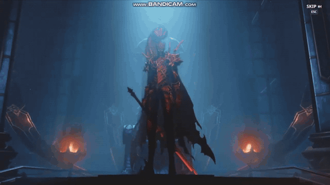<br/><sub><b>보스 등장</b> — 컷신 영상이 끝나면 시네마틱 카메라가 보스를 비춘 뒤 전투 시작</sub></td>
    <td width="50%">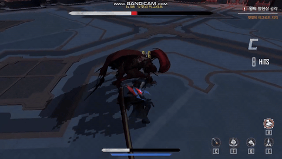<br/><sub><b>보스전</b> — 무기 트레일 · 데미지 숫자 · 콤보 등급</sub></td>
  </tr>
  <tr>
    <td>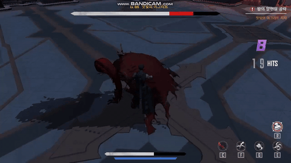<br/><sub><b>장판 패턴</b> — 안쪽 원에서 바깥 링으로 넓어지는 연속 장판</sub></td>
    <td>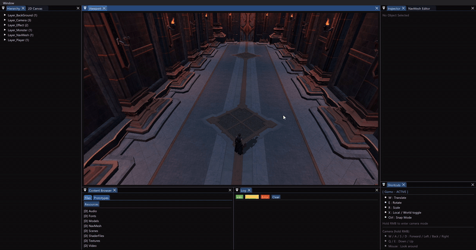<br/><sub><b>에디터</b> — 게임 런타임을 그대로 띄우고 F5로 편집 · 플레이 전환</sub></td>
  </tr>
</table>

---

## 설계 및 구조

### 모듈 구조

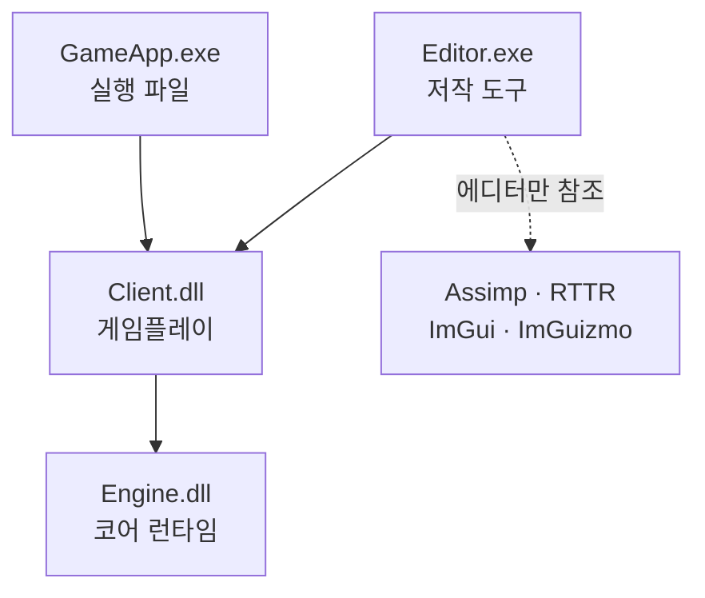

- 게임플레이를 DLL로 두어, 에디터가 게임 오브젝트 원형(Prototype)을 그대로 복제(Clone)해 띄움 — 에디터에서 보는 것이 실제 게임과 같은 코드
- Assimp · RTTR · ImGui · ImGuizmo는 에디터에서만 참조 — 런타임은 에디터가 만든 자체 바이너리만 읽음
- 빌드 후 헤더 · lib · dll을 `EngineSDK` · `ClientSDK`로 복사해 상위 모듈이 참조

### 데이터 파이프라인

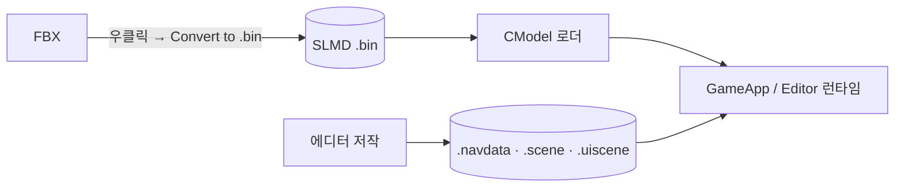

| 파일 | 매직 | 버전 | 내용 |
| --- | --- | ---: | --- |
| 모델 `.bin` | `SLMD` | 1 ~ 3 | 메시 · 머티리얼 · 뼈 · 애니메이션 · 루트 모션 · 노티파이 |
| `.navdata` | `SLNM` | 1 | NavMesh 정점 · 셀 — 이웃 정보는 로드 후 재계산 |
| `.scene` | `SLSC` | 1 ~ 5 | NavData 경로 · 스폰 위치 · 조명 · 카메라 콜라이더 |
| `.uiscene` | `SLUI` | 1 ~ 7 | UI 요소 배치 · 텍스처 · 색 · 표시 방식 |

### 프레임 갱신 순서

```
CGameInstance::Update_Engine
  Sound → Input → Priority_Update(카메라) → Update(게임 로직)
        → PipeLine(뷰 · 투영 역행렬) → Frustum → Late_Update(렌더 등록)
        → Collision(충돌 쌍 검사 · 이벤트) → Level
```

---

## 주요 구현

### 1. 에디터

모델 변환부터 NavMesh · 스폰 · UI 배치까지 **화면에서 만들고 바로 확인하려고** 전용 에디터를 만들었습니다.

<table>
  <tr>
    <td width="50%">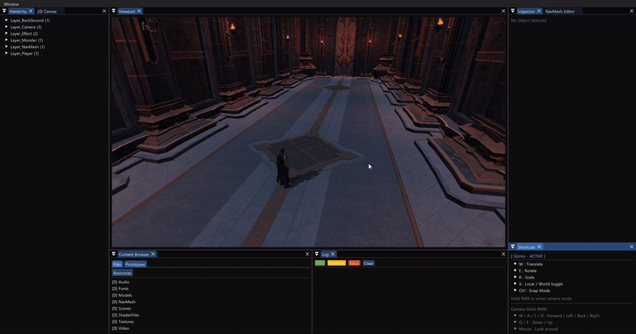<br/><sub><b>오브젝트 선택</b> — 인스펙터에 RTTR 속성 · 모델 정보 · 애니메이션 목록 표시</sub></td>
    <td width="50%"><br/><sub><b>편집 → 플레이 (F5)</b> — 자유 카메라에서 추적 카메라로 바뀌고 바로 조작</sub></td>
  </tr>
</table>

```
CEditorApp                       ImGui 도킹 · 패널 관리 · 편집 / 플레이 전환
├── Panel_Viewport               씬 렌더 타깃 · ImGuizmo 이동 / 회전 / 크기 · NavMesh · 콜라이더 점 찍기
├── Panel_Hierarchy              레이어별 오브젝트 목록
├── Panel_Inspector              RTTR 속성 · 애니메이션 루프 / 루트 모션 / 노티파이 편집
├── Panel_ContentBrowser         리소스 탐색 · FBX 우클릭 변환
├── Panel_NavMeshEditor          NavMesh · 스폰 · 조명 · 카메라 콜라이더 저작
├── Panel_2DCanvas               UI 요소 배치 · 속성 편집
└── Panel_Log · Panel_Shortcuts  로그 · 단축키 안내
```

- 에디터가 Client의 게임플레이 레벨을 그대로 열어, 실제 게임 화면 위에서 편집
- `F5`로 편집 / 플레이 전환 — 편집 중에는 게임 로직을 멈추고 자유 카메라 사용

```cpp
// CEditorApp::Apply_Mode
m_pGameInstance->Set_GameLogic_Frozen(m_bEditMode);      // 편집 중에는 게임 로직 정지
m_pGameInstance->Set_CursorLocked(!m_bEditMode);

Set_CameraActive(TEXT("Follow"), false == m_bEditMode);   // 플레이: 추적 카메라
Set_CameraActive(TEXT("Free"), true == m_bEditMode);      // 편집: 자유 카메라
```

### 2. 모델 바이너리 포맷 (SLMD)

런타임이 Assimp에 묶이지 않도록, **에디터에서 FBX를 한 번 변환해 자체 바이너리로 저장**하고 엔진은 이 파일만 읽습니다.

<p align="center">
  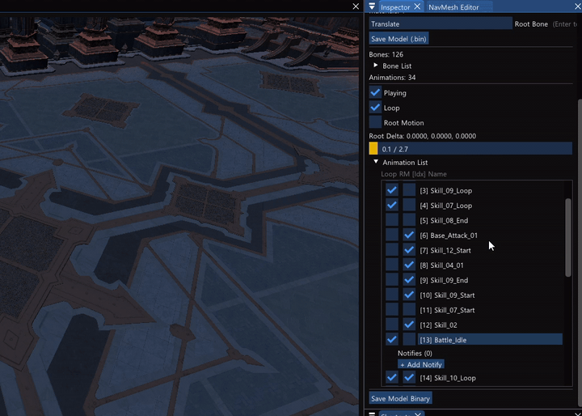
  <br/><sub>인스펙터에서 애니메이션을 고르면 뷰포트에서 재생되고, 루프 · 루트 모션 · 노티파이(시점 · 종류)를 편집</sub>
</p>

- 노드 계층에서 뼈를 모은 뒤 메시 · 머티리얼 · 뼈 · 애니메이션 순서로 기록, 저해상도 · LOD 1 이상 메시는 제외
- 헤더에 매직 `SLMD`와 버전을 기록 — 버전 2에 루트 모션, 버전 3에 노티파이를 추가하고 이전 버전 파일도 분기해서 읽음
- 인스펙터에서 고친 루프 · 루트 모션 · 노티파이를 같은 포맷으로 다시 저장

```cpp
// CModel::Load_Binary_Desc (요약)
if (iVersion < SLMD_VERSION_MIN || iVersion > SLMD_VERSION_LATEST) { fclose(fp); return E_FAIL; }
// ...
if (iVersion >= 2)
    fread(pOutDesc->szRootBoneName, sizeof(char), MAX_PATH, fp);     // v2: 루트 모션 기준 뼈
// ... 애니메이션마다
if (iVersion >= 3)
    fread(&Anim.iNumNotifies, sizeof(_uint), 1, fp);                  // v3: 노티파이 개수 (이어서 시점 · 종류)
```

### 3. 애니메이션 시스템

공격 · 이동 · 가드 · 무기 상태가 늘면서 애니메이션 번호를 코드에 쓰기 어려워져, **상태 · 행동 · 단계 · 무기 조합으로 애니메이션을 고르게** 했습니다.

<p align="center">
  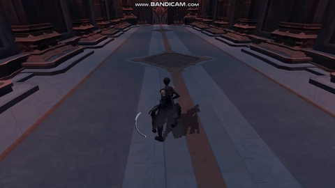
  <br/><sub>기본 공격 연계 — 행동마다 진입 블렌드 시간을 두고 크로스페이드</sub>
</p>

- 상태 · 행동 · 단계 · 무기 · 장착 무기를 64비트 키 하나로 묶고, 테이블에 적은 애니메이션 이름은 등록할 때 인덱스로 바꿔 캐시
- 크로스페이드 — 크기 · 위치는 선형 보간, 회전은 Slerp
- 노티파이 13종(공격 판정 · 콤보 입력 구간 · 무적 · 무기 트레일 · 발소리 등) — 이전 프레임과 현재 프레임 사이를 지난 것만 발생

```cpp
// Make_CharacterAnimKey — 의미 5개를 64비트 키 하나로
return (ETOUI64(eState) << 56) | (ETOUI64(eAction) << 48) | (ETOUI64(eStep) << 40) |
       (ETOUI64(eWeapon) << 32) | (ETOUI64(eEquippedId) << 24);

// CAnimController::Play (요약)
if (false == m_bHasCurrentClip || fBlendTime <= 0.f)
    m_pModel->Set_AnimationIndex(Clip.iAnimationIndex);
else
    m_pModel->Set_AnimationIndex_WithBlend(Clip.iAnimationIndex, fBlendTime, Clip.bRestartOnEnter);
```

### 4. 루트 모션

대시 · 공격 · 스킬처럼 이동이 애니메이션 안에 들어 있는 동작은 **루트 뼈가 움직인 만큼 캐릭터를 옮깁니다.** 메시는 제자리에서 재생되고, 이동은 Transform이 맡습니다.

<p align="center">
  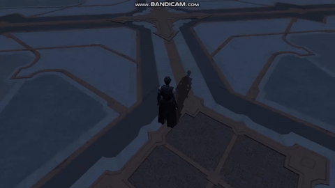
  <br/><sub>보스 돌진 — 루트 모션 이동량을 플레이어 앞 목표 지점까지의 거리에 맞춰 조절</sub>
</p>

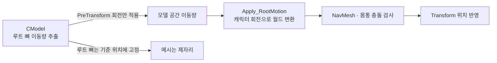

- 루프가 처음으로 돌아간 프레임은 이동량 0 — 끝에서 처음으로 되돌아가는 값이 튀지 않게
- 크로스페이드 중에는 두 애니메이션의 이동량을 블렌드 비율로 섞음 — [트러블 슈팅 2](#2-대시에-들어가는-순간-캐릭터가-앞으로-튀던-문제)
- 대시 · 공격 중에는 입력 이동을 끄고 루트 모션으로만 이동
- 보스 돌진은 플레이어 앞 2.8 지점까지의 거리에 맞춰 이동량을 0.35 ~ 5배로 조절하고, 목표를 넘지 않게 자름

```cpp
// CModel::Extract_RootMotion (요약)
_float3 T_cur = { pMatrix->_41, pMatrix->_42, pMatrix->_43 };    // 이번 프레임 루트 뼈 위치
// ... 첫 프레임은 기준 위치만 기록
else if (bWrapped)
{
    m_vLastRootMotionDelta = {};                                  // 루프 경계 — 이동 0
    m_vPrevRootTranslation = T_cur;
}
else
{
    vLocalDelta.x = T_cur.x - m_vPrevRootTranslation.x;           // (y · z 동일)
    vDelta = XMVector3TransformNormal(vDelta, matPre);            // PreTransform의 회전만 적용
    XMStoreFloat3(&m_vLastRootMotionDelta, vDelta);
}

matFixed._41 = m_vBindRootTranslation.x;                          // 루트 뼈는 기준 위치에 고정 (y · z 동일)
pRootBone->Set_TransformationMatrix(XMLoadFloat4x4(&matFixed));
```

### 5. 입력 · 행동 상태 머신

공격 중 회피, 피격 중 공격 같은 끼어들기 규칙을 한곳에서 관리하려고, **입력은 의도로 바꾸고 전환 여부는 우선순위 표로 판단**합니다.

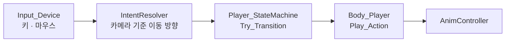

| 우선순위 | 행동 |
| ---: | --- |
| 0 | 대기 · 걷기 · 달리기 |
| 1 | 정지 · 무기 넣기 |
| 3 | 기본 공격 1 ~ 3타 |
| 4 | 가드 |
| 5 | 스킬 Q · E · F · 무기 교체 |
| 6 | 대시 · 피격 경직 |
| 7 | 공중에 뜸 · 다운 · 낙법 |
| 8 | QTE · 패리 반격 |

- Engine `CStateMachine`(추상) — 낮은 우선순위로의 전환 거부 · 금지 쌍(예: 대시 중 가드) · 쿨다운 · 끝나면 자동 복귀
- Client `CPlayer_StateMachine` — 테이블 정책을 등록하고, 전환할 때 애니메이션 · 이동 속도 · 패리 구간 갱신
- `IntentResolver` — WASD 입력을 카메라 Yaw만큼 회전시켜 월드 이동 방향으로 변환

```cpp
// CStateMachine::Try_Transition (요약)
for (const auto& Reject : m_Rejects)                          // 금지 쌍
    if (Reject.first == m_iCurrentAction && Reject.second == iNext)
        return false;

if (NextPolicy.iPriority < CurrentPolicy.iPriority)           // 낮은 우선순위는 끼어들 수 없음
    return false;
// ... 쿨다운 검사
m_iCurrentAction = iNext;
On_Transition(iPrev, iNext, false);                           // 파생 클래스가 애니메이션 · 이동 처리
```

### 6. 충돌 · 공격 판정 구조

공격 판정을 오브젝트끼리 직접 검사하지 않고, **콜라이더를 그룹으로 등록하면 매니저가 쌍을 검사해 이벤트로 알려줍니다.**

- 그룹 행렬로 검사할 조합만 지정 — 플레이어 몸 ↔ 몬스터 몸 · 플레이어 공격 ↔ 몬스터 몸 · 몬스터 공격 ↔ 플레이어 몸
- 이번 프레임과 이전 프레임의 충돌 쌍을 비교해 Enter · Stay · Exit 전달
- 무기 OBB는 손 소켓 뼈 행렬로 매 프레임 갱신하고, 노티파이가 연 공격 구간에만 활성화

```cpp
// CCollision_Manager::Check_PairsAndFire (요약)
PairKey Key = (pA < pB) ? make_pair(pA, pB) : make_pair(pB, pA);       // 정렬된 키
if (!m_CurrPairs.insert(Key).second)
    continue;                                                           // 이번 프레임에 이미 처리한 쌍
if (m_PrevPairs.find(Key) == m_PrevPairs.end())
    { pA->Notify_HitEnter(pB); pB->Notify_HitEnter(pA); }
else
    { pA->Notify_HitStay(pB);  pB->Notify_HitStay(pA); }
```

### 7. 카메라

3인칭 카메라가 캐릭터를 부드럽게 따라가고 벽을 뚫지 않도록 **스프링암과 카메라 콜라이더**를 만들었습니다.

<table>
  <tr>
    <td width="50%">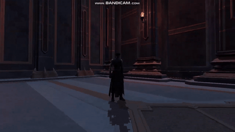<br/><sub><b>추적 카메라</b> — 마우스로 회전하며 이동</sub></td>
    <td width="50%">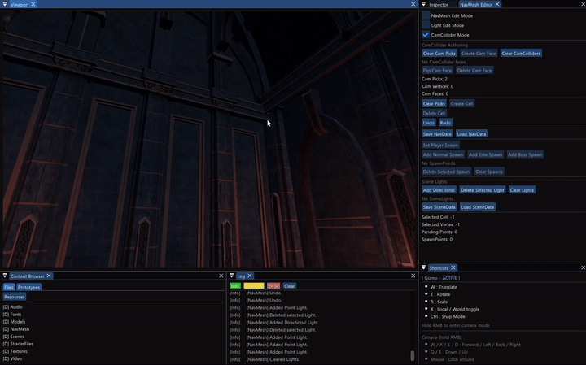<br/><sub><b>카메라 콜라이더 저작</b> — 벽을 따라 점을 찍어 삼각형 면 생성</sub></td>
  </tr>
</table>

**스프링암**
- Yaw · Pitch 값만 저장하고 매 프레임 쿼터니언을 새로 구성 — 누적 오차 · Roll 누적 방지
- 충돌로 팔이 줄 때는 즉시, 원래 길이로 돌아갈 때만 지수 보간

**카메라 콜라이더 — 삼각형으로 감싼 입체 공간**
- 복잡한 맵 메시 대신, 방을 감싸는 단순한 삼각형 메시를 에디터에서 만들어 카메라 충돌에만 사용
- 맵 표면을 클릭해 점 3 ~ 4개로 면을 만들고, 기존 정점에 스냅해 면끼리 정점을 공유
- 왕좌의 방은 삼각형 34개가 정점 22개를 공유하며 방 전체를 감쌈 — `.scene` 버전 5에 저장
- 대상 → 카메라 방향 광선과 가장 가까운 교차 지점에서 여백만큼 앞까지 팔 길이를 줄임

<p align="center">
  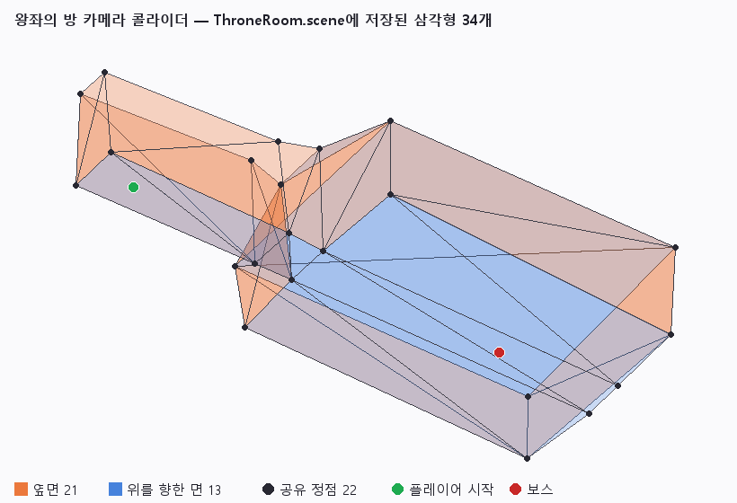
  <br/><sub><code>ThroneRoom.scene</code>에 저장된 카메라 콜라이더 데이터를 그대로 그린 그림</sub>
</p>

```cpp
// CCamera_Follow::Apply_CamCollider (요약)
for (const CAMCOLLIDER_FACE& Face : m_CamColliderFaces)
{
    // ... 면의 정점 v0 · v1 · v2 로드
    if (TriangleTests::Intersects(vTarget, -vLook, v0, v1, v2, fDistance) &&
        fDistance >= 0.f && fDistance <= fIdealDistance && fDistance < fNearestDistance)
    {
        fNearestDistance = fDistance;                       // 가장 가까운 교차
        bHit = true;
    }
}
// bHit이면 교차 거리에서 여백을 뺀 길이로 스프링암을 줄임
```

### 8. NavMesh · 씬 데이터

캐릭터가 갈 수 있는 영역과 스폰 · 조명 · 트리거 위치를 데이터로 관리하려고, **NavMesh와 씬 파일을 에디터에서 만듭니다.**

<table>
  <tr>
    <td width="50%">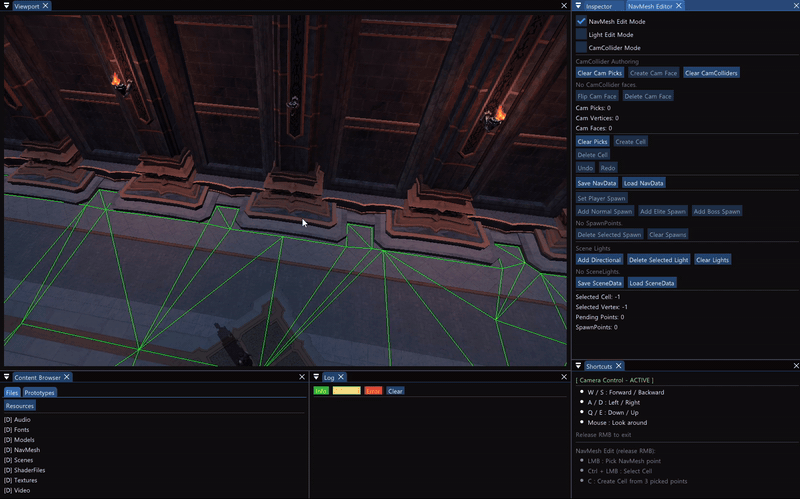<br/><sub><b>NavMesh 셀</b> — 점 3개를 찍어 셀 생성 후 Undo로 되돌림</sub></td>
    <td width="50%">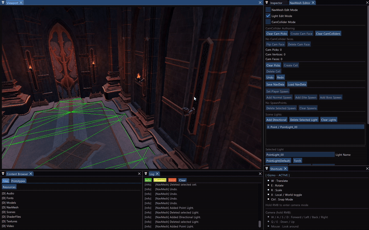<br/><sub><b>조명</b> — 점광원을 추가하고 위치 · 범위 · 색 편집</sub></td>
  </tr>
  <tr>
    <td colspan="2" align="center">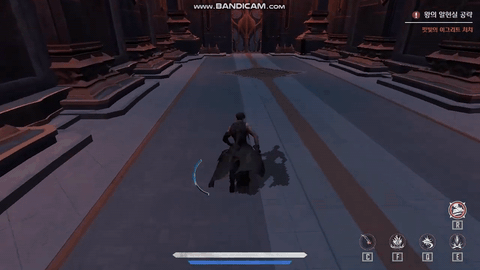<br/><sub><b>셀 트리거</b> — 지정한 셀에 들어서면 컷신 재생</sub></td>
  </tr>
</table>

- 점 3개를 찍어 셀 생성 — 기존 정점에 스냅해 공유, 너무 작은 셀은 거부, 정점 순서는 반시계로 통일
- 편집 전 상태를 스냅샷으로 남겨 Undo / Redo
- 스폰 · 조명 · 카메라 콜라이더도 같은 툴에서 배치해 `.scene`으로 저장
- 런타임에는 현재 셀 안이면 높이만 보정하고, 벗어나면 이웃 셀을 따라가 찾고 못 찾으면 이동 거부

```cpp
// CNavMesh::Try_Move (요약)
if (true == m_Cells[iCurrentCellIndex]->Is_In(vCandidatePosition, &iNeighborIndex))
{
    pOutAdjustedPosition->y = m_Cells[iCurrentCellIndex]->Compute_Height(vCandidatePosition);
    return true;                                            // 같은 셀 — 높이만 보정
}

while (true == Is_ValidCellIndex(iNeighborIndex) && iHopCount < iMaxHopCount)
{
    // ... 빠져나간 변의 이웃 셀로 이동해 다시 검사, 들어가 있으면 그 셀로 갱신 후 true
}
return false;                                               // NavMesh 밖 — 이동 거부
```

### 9. UI 씬 · 영상 재생

HUD 위치를 코드에 적지 않도록 **2D 캔버스에서 배치해 `.uiscene`으로 저장**하고, 게임은 이 파일을 읽어 UI를 만듭니다.

<p align="center">
  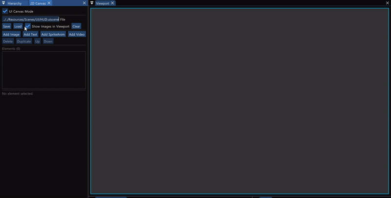
  <br/><sub>2D 캔버스 — HUD.uiscene을 불러와 요소 선택 · 이동 · 크기 조절</sub>
</p>

- 이미지 · 텍스트 · 스프라이트 애니메이션 · 영상 요소를 배치 · 복제하고 그리기 순서를 조절 — 타이틀 · 로딩 · HUD를 같은 방식으로 구성
- 게임은 레벨마다 해당 `.uiscene`을 읽어 UI 생성
- 컷신 영상은 Media Foundation으로 디코딩하고, 재생 시간이 된 프레임만 D3D11 동적 텍스처에 복사
- 사운드는 FMOD를 엔진 사운드 매니저로 감싸고, 게임 코드는 `CGameInstance` 위임 함수만 사용

### 10. 보스전 콘텐츠

콘텐츠는 **왕좌의 방 보스전 하나**입니다. 위의 시스템을 조합해 만들었습니다.

```
타이틀 → 로딩 → 왕좌의 방 → 트리거 셀 → 컷신 영상 · 시네마틱 카메라 → 보스전 → 처치
```

<table>
  <tr>
    <td width="50%">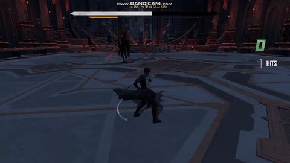<br/><sub><b>원거리 접근</b> — 멀리 있는 플레이어 앞까지 뛰어들어 내려찍음</sub></td>
    <td width="50%">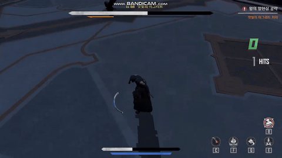<br/><sub><b>원형 장판</b> — 예고 장판이 차오른 뒤 판정</sub></td>
  </tr>
  <tr>
    <td>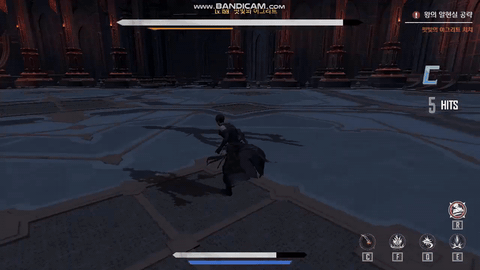<br/><sub><b>HUD</b> — 콤보 등급 · 보스 체력 바 감소 잔상</sub></td>
    <td>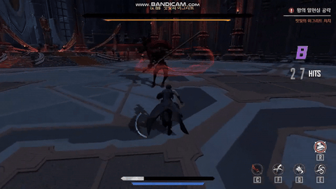<br/><sub><b>처치</b> — 마지막 공격 후 대검만 남기고 전투 종료</sub></td>
  </tr>
</table>

**보스 패턴**
- 거리 구간(근 · 중 · 원)마다 후보와 점수를 두고, 쿨다운이 끝난 패턴 중 점수가 가장 높은 것을 선택
- 직전 · 그 전 패턴과 장판 연속은 감점, 그로기에서 회복한 직후에는 전용 후보에서 선택
- 장판은 예고를 먼저 띄운 뒤 판정 — 원형 · 링 범위 + 높이 차, 연속 장판은 원 → 링 → 링 → 큰 원

| 거리 | 패턴 |
| --- | --- |
| 근거리 | 제자리 점프 공격 · 기본 공격 2종, 오래 머물면 원형 · 연속 장판 추가 |
| 중거리 | 플레이어 방향 강공격 · 접근 공격 |
| 원거리 | 플레이어 앞까지 뛰어드는 접근 공격 — [루트 모션](#4-루트-모션)으로 거리 보정 |

**전투 규칙**
- 회피 무적 중 피격되면 회피 성공 — 3초 안에 `Shift`로 QTE 반격
- 가드 시작 구간에 피격되면 패리 — 피해 무효 · 공격자 강제 브레이크
- 브레이크 게이지를 모두 깎으면 그로기(CRASH), 피격 경직은 피해량에 따라 4단계

**HUD · 연출**
- 체력 바 지연 감소(잔상이 1초 머문 뒤 따라옴) · 콤보 등급 7단계(5초마다 한 단계 하락) · 크리티컬 데미지 숫자
- 무기 트레일 — 칼날 시작 · 끝 점을 프레임마다 샘플링해 띠 메시로 그림

---

## 트러블 슈팅

### 1. 카메라 상하 회전이 바라보는 방향에 따라 달라지던 문제

**문제**
- 옆(Yaw ±90°)을 보면 상하 회전이 거의 먹지 않고, 뒤(±180°)를 보면 상하가 뒤집힘

**원인**
- `XMQuaternionMultiply(A, B)`는 수식으로 `B · A` — `(qYaw, qPitch)` 순서는 Pitch를 **월드 X축**으로 적용
- 그래서 시선 높이가 `Look.y = -sin(Pitch) · cos(Yaw)`로 Yaw에 묶임
- 처음 의심한 기저 벡터 외적 퇴화는 직교성 로그 0건으로 기각, 위 식은 여러 Yaw의 로그 값과 일치해 확정

**해결**
- 인자 순서를 바꿔 Pitch를 먼저(로컬 X축), Yaw를 월드 Y축으로 적용 — `Look.y = -sin(Pitch)`

```diff
  // CSpringArm::Initialize · Update_Rotation
- _vector q = XMQuaternionMultiply(qYaw, qPitch);
+ _vector q = XMQuaternionMultiply(qPitch, qYaw);
```

### 2. 대시에 들어가는 순간 캐릭터가 앞으로 튀던 문제

**문제**
- 크로스페이드로 대시에 들어가면 캐릭터가 약 0.25m 앞으로 튐

**원인**
- 블렌드 · 루트 모션 디버그 로그로 프레임별 이동량을 추적해, 블렌드가 끝난 직후 루트 추적이 처음부터 다시 시작되는 것을 확인
- 블렌드가 끝날 때 `Set_RootMotionEnabled`가 루트 모션 상태를 초기화 — 블렌드 동안 추적한 이전 위치 · 기준 위치가 끊김

**해결**
- 초기화 전에 블렌드 쪽 추적 상태를 백업했다가 일반 재생으로 넘겨 이어서 추적

```cpp
// CModel::Play_Animation_Blended — 블렌드 종료 처리 (요약)
_float3 vPrevTo_Backup = m_vPrevRootTranslation_To;      // 블렌드 동안 추적한 이전 루트 위치
_bool   bInitTo_Backup = m_bBlendRMInitialized_To;
_float3 vBind_Backup   = m_vBindRootTranslation;

Set_RootMotionEnabled(bToUseRM);                         // 내부에서 루트 모션 상태 초기화

if (bToUseRM && bInitTo_Backup)
{
    m_vPrevRootTranslation = vPrevTo_Backup;             // 일반 재생이 이어서 추적
    m_vBindRootTranslation = vBind_Backup;
    m_bRootMotionInitialized = true;
}
```

---

## 기술 스택

**언어 · 그래픽스**

| 기술 | 활용 |
| --- | --- |
| C++ | 엔진 · 게임플레이 DLL과 실행 파일 · 에디터 EXE로 4모듈을 구성하고, 추상 상태 머신 · 컴포넌트를 파생해 게임 로직 구현 |
| DirectX 11 | 영상 프레임을 동적 텍스처에 `Map`으로 올리고, 무기 트레일 · 장판 예고를 셰이더로 그림 |
| HLSL (Effects11) | 장판 예고의 채움 비율 · 안쪽 반지름을 셰이더 값으로 받아 원 · 링 모양 표현 |

**툴 · 라이브러리**

| 기술 | 활용 |
| --- | --- |
| ImGui · ImGuizmo | 도킹 에디터 패널 8종과 뷰포트 오브젝트 변환 |
| Assimp | 에디터에서만 FBX를 읽어 자체 바이너리(SLMD)로 변환 |
| RTTR | Transform · 오브젝트 속성을 등록하고 인스펙터가 순회해 편집 UI 생성 |
| FMOD | 엔진 사운드 매니저로 감싸 폴더 단위 등록 · 채널 그룹별 재생 |
| Media Foundation | 컷신 영상을 디코딩해 재생 시간에 맞춰 프레임 공급 |

**자료구조 · 알고리즘**

| 기술 | 활용 |
| --- | --- |
| 해시 맵 | 64비트 애니메이션 키 → 애니메이션 인덱스, 행동 키 → 우선순위 정책 조회 |
| set | 이번 / 이전 프레임 충돌 쌍을 비교해 Enter · Stay · Exit 판정 |
| 쿼터니언 회전 | Yaw · Pitch 값으로 매 프레임 카메라 회전을 구성 |
| 광선-삼각형 교차 | 카메라 콜라이더 메시와의 교차 거리로 스프링암 길이 조정 |
| 셀 이웃 탐색 | 빠져나간 변의 이웃 셀을 따라가며 NavMesh 위 위치와 높이 계산 |
| 가중치 선택 | 거리 구간별 점수와 반복 감점으로 보스 패턴 선택 |

**설계**

| 기술 | 활용 |
| --- | --- |
| DLL 모듈 분리 · Prototype / Clone | 게임플레이 DLL을 게임과 에디터가 함께 쓰고, 에디터가 게임 오브젝트 원형을 그대로 복제해 편집 |
| 상태 머신 + 정책 테이블 | 우선순위 · 자동 복귀 · 금지 쌍 · 쿨다운을 데이터로 등록해 행동 전환 판단 |
| 관찰자 (노티파이 리스너) | 애니메이션 키프레임 이벤트를 상태 머신 · 무기 판정 · 사운드로 전달 |
| 버전 있는 바이너리 직렬화 | 매직 + 버전 헤더와 버전별 분기로 이전 파일 호환 |

---

> 학습 목적의 개인 모작입니다. 원작 「나 혼자만 레벨업: ARISE OVERDRIVE」의 모델 · 애니메이션 · 텍스처 · 영상 · 사운드 등 리소스 저작권은 원저작권자에게 있습니다.
